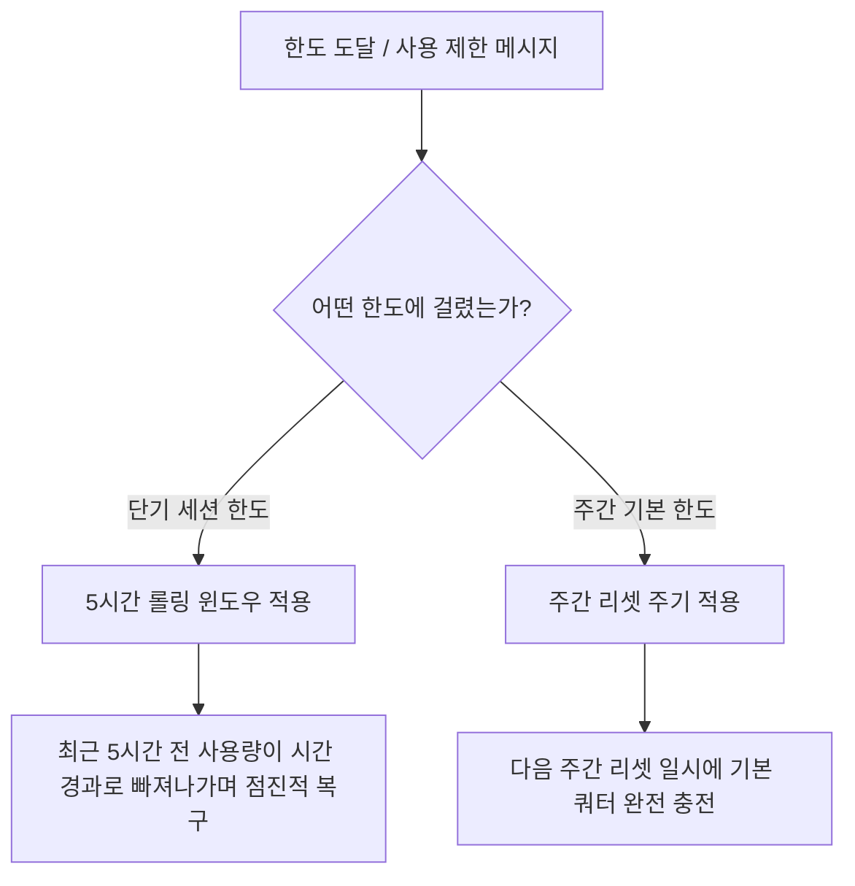

# Google Antigravity 무료 사용량 및 리셋 주기 안내

> 확인일: 2026-08-31  
> 대상: **Google Antigravity (무료 기본 계정 / Free Tier)**  
> *참고: Google AI Pro/Ultra 구독 또는 개인 Gemini API 키 연동 시 별도의 쿼터 및 과금 정책이 적용됩니다.*

---

## 1. 핵심 요약 (결론)

- **고정된 "하루 N회"가 아님**: Antigravity는 단순 질의응답이 아닌 파일 읽기/쓰기, 터미널 명령, 웹 검색을 수행하는 **에이전틱(Agentic) AI**이므로, 고정된 프롬프트 횟수가 아니라 **작업의 복잡도와 실제 소모된 연산량(토큰/작업량)**을 기준으로 쿼터가 차감됩니다.
- **기본 리셋 주기 (5시간 롤링 윈도우)**: 사용량 제한(Rate Limit)은 매일 밤 자정(00:00)에 한 번에 풀리는 방식이 아니라, **최근 5시간 동안의 사용량을 추적하는 5시간 롤링 윈도우(Rolling Window)** 방식으로 회복됩니다.
- **주간 기본 한도 (Weekly Quota)**: 무료 계정은 5시간 단기 한도 외에도 **주간 기본 배정량(Weekly Allotment)**이 적용되며, 주간 총량이 모두 소진되면 다음 주간 리셋 주기까지 기다려야 합니다.
- **수동 리셋 불가**: 사용량 제한은 시스템 용량 및 정책에 따라 자동 관리되므로 수동 초기화나 고객지원을 통한 강제 리셋은 불가능합니다.

---

## 2. 하루에 어느 정도 사용할 수 있나? (일일 사용량 기준)

Antigravity의 사용량은 "질문을 몇 번 했는가"가 아니라 **"에이전트가 어떤 모델로 얼마나 많은 작업을 수행했는가"**에 따라 결정됩니다.

### A. 작업 유형별 사용량 체감

| 작업 유형 | 작업 내용 예시 | 쿼터 소모 수준 | 일일 체감 사용 가능량 |
| :--- | :--- | :--- | :--- |
| **가벼운 작업 (Light)** | 단일 함수 수정, 단순 질문, 주석/문서 작성, 인라인 자동완성(`Tab`, `Ctrl+I`) | **매우 적음** | 수십 회 이상 여유롭게 사용 가능 |
| **중간 작업 (Medium)** | 단위 테스트 작성, 2~3개 파일 리팩토링, 오류 로그 분석 및 패치 | **보통** | 하루 10~20회 내외 수행 가능 |
| **대규모 작업 (Heavy)** | 전체 코드베이스 분석, 다중 파일 신규 모듈 설계, 브라우저/터미널 자율 검증 루프 | **매우 큼** | 몇 번의 대형 작업만으로도 단기 제한 도달 가능 |

> [!NOTE]
> 에이전트가 파일 탐색, 하위 에이전트 생성, 웹 검색 등을 반복 실행할수록 1회의 사용자 프롬프트에서도 백그라운드 토큰 소모량이 급격히 증가합니다.

### B. 모델 선택에 따른 쿼터 차이 (공유 쿼터)
Google Antigravity는 Gemini 계열 모델 간 **단일 공유 쿼터(Shared Quota)** 풀을 제공합니다.
- **Gemini Flash (예: Gemini 3.5 / 3.7 Flash)**: 연산 소모량이 적어 쿼터를 적게 소비하므로 일상적인 코딩, 단순 수정, 빠른 문답에 적합합니다.
- **Gemini Pro / Ultra (예: Gemini 3.1 Pro)**: 심층 추론과 대규모 아키텍처 분석에 탁월하지만 쿼터 소모량이 Flash 대비 큽니다.

---

## 3. 제한이 걸렸을 때 리셋 주기 및 재개 시점

사용량 한도에 도달하면 상태에 따라 다음과 같은 주기로 재개됩니다.

### 1) 5시간 롤링 윈도우 (단기 속도 제한)
- **방식**: 고정된 시각(예: 00:00, 12:00)에 100% 리셋되는 것이 아닙니다.
- **원리**: 현재 시점 기준 "지난 5시간 동안 사용한 총량"을 계산합니다. 시간이 지나면서 5시간 이전의 사용 기록이 창 밖으로 밀려나면 그만큼의 사용량이 점진적으로 다시 채워집니다.
- **대기 시간**: 대개 **수십 분 ~ 최대 5시간 이내**에 점진적으로 다시 프롬프트 입력이 가능해집니다.

### 2) 주간 쿼터 한도 (무료 플랜 기본 배정량)
- 무료 플랜 사용자에게 부여된 주간 전체 용량이 소진된 경우, 5시간이 지나도 사용이 재개되지 않을 수 있습니다.
- 이 경우 계정 사용량 대시보드에 표시된 **다음 주간 리셋 일시**에 기본 용량이 다시 초기화됩니다.

---

## 4. 남은 사용량 및 리셋 시점 확인 방법

현재 잔여 쿼터와 다음 리셋 시점은 CLI 및 IDE 내에서 실시간으로 확인할 수 있습니다.

| 확인 위치 | 실행 방법 | 확인 가능한 정보 |
| :--- | :--- | :--- |
| **CLI / 채팅창** | `/usage` 또는 `/quota`, `/status` 입력 | 현재 소모율, 잔여 쿼터(%), 다음 롤링 리셋 예상 시점 |
| **CLI 상태줄 (Statusline)** | 화면 우측 하단 상태 표시줄 확인 | 현재 세션 상태 및 AI 크레딧/쿼터 상태 |
| **웹 대시보드** | [Google Antigravity 대시보드](https://antigravity.google) 로그인 | 플랜 등급, 주간/월간 사용량 통계, 결제/크레딧 정보 |

> [!TIP]
> 작업 중 제한 안내가 표시되면 채팅창에 `/usage`를 입력하여 단기 5시간 윈도우 제한인지 주간 한도 소진인지 확인하세요.

---

## 5. 무료 쿼터를 아끼고 효율적으로 쓰는 꿀팁

1. **상황에 맞는 모델 전환**:
   - 보일러플레이트 생성, 단순 오타 수정, Git 커밋 메시지 작성 등은 **Gemini Flash**를 활용합니다.
   - 복잡한 알고리즘, 시스템 설계 시에만 **Gemini Pro**를 선택합니다.
2. **구체적인 컨텍스트 지정 (`@` 멘션 활용)**:
   - 전체 프로젝트를 무차별 스캔하게 하지 않고, `@src/components/Button.tsx`, `@Terminal`처럼 필요한 파일만 정확히 지정하면 불필요한 토큰 낭비를 줄일 수 있습니다.
3. **계획 모드(`implementation_plan.md`) 적극 활용**:
   - 복잡한 작업 전 에이전트가 생성한 계획서를 검토하여 불필요한 파일 수정이나 엉뚱한 루프를 사전에 차단합니다.
4. **인라인 편집(`Ctrl + I`) 및 Antigravity Tab 활용**:
   - 전체 채팅창 대신 특정 코드 블록만 지정하여 `Ctrl + I`로 수정하면 컨텍스트 길이가 짧아져 쿼터 소모를 대폭 줄일 수 있습니다.

---

## 6. 사용량이 더 필요할 경우의 대안

- **유료 구독 플랜**:
  - **Google AI Pro** ($20/월): 더 넉넉한 5시간 롤링 쿼터 및 높은 우선순위 제공
  - **Google AI Ultra** ($100 / $200/월): 대규모 프로덕션 개발 및 집중 사용을 위한 최상위 쿼터
- **AI Credits 구매**:
  - Pro/Ultra 플랜에서 기본 쿼터 소진 시 종량제 형태로 AI 크레딧을 충전하여 중단 없이 사용 가능
- **개인 Gemini API 키 연동**:
  - Google Cloud / Google AI Studio에서 발급받은 API 키를 연결하여 API 종량제 요금으로 사용 가능

---

## 7. 한 줄 요약

> **Google Antigravity 무료 사용량은 고정된 일일 횟수가 아닌 작업량(Compute) 기반이며, 기본적으로 5시간 롤링 윈도우(Rolling Window)를 통해 사용량이 점진적으로 회복되고 주간 기본 한도가 적용됩니다. 실시간 잔여량 및 리셋 시점은 `/usage` 명령어로 확인할 수 있습니다.**
