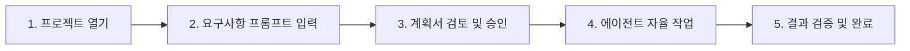

# Google Antigravity (안티그래비티) 사용자 매뉴얼
**초보자를 위한 차세대 AI 에이전트 개발 환경 완벽 가이드**

---

## 1. Google Antigravity 소개

**Google Antigravity(AGY)** 는 단순한 코드 자동 완성을 넘어, 개발자와 대등하게 협업하는 **차세대 에이전틱(Agentic) AI 개발 플랫폼**입니다.  
파일 탐색, 코드 작성 및 수정, 터미널 명령어 실행, 브라우저 테스트, 웹 검색 등을 스스로 계획하고 실행하며 개발자의 생산성을 극대화합니다.

### 🌟 핵심 특징
- **자율 에이전트(Autonomous Agent)**: 복잡한 요구사항을 스스로 분해하여 파일 생성, 수정, 테스트, 디버깅까지 일괄 처리합니다.
- **계획 모드(Planning Mode)**: 대규모 변경 전 구현 계획서(`implementation_plan.md`)를 작성하고, 사용자 승인 후 안전하게 실행합니다.
- **지능형 다중 표면(Multi-Surface)**: 전용 IDE, 데스크톱 앱(Antigravity 2.0), CLI 터미널 도구를 모두 지원합니다.
- **풍부한 확장성**: 프로젝트별 규칙(Rules), 스킬(Skills), MCP(Model Context Protocol)를 통해 맞춤형 개발 환경을 구성합니다.

---

## 2. 세 가지 핵심 상호작용 모드 (Core Modalities)

안티그래비티는 개발 작업의 규모와 성격에 맞춰 3가지 상호작용 방식을 제공합니다.

| 모드 | 상호작용 방식 | 주요 사용 상황 | 기본 조작 / 단축키 |
| :--- | :--- | :--- | :--- |
| **수동형 (Passive)** | **Antigravity Tab** | 타이핑 중 다음 코드 라인 예측, 자동 Import, 위치 이동 | `Tab` (수락), `Esc` (취소), `Ctrl + →` (단어별 수락) |
| **지시형 (Instructive)** | **인라인 편집 (Inline Command)** | 특정 코드 블록 리팩토링, 오류 수정, 빠른 주석 생성 | `Ctrl + I` (macOS: `Cmd + I`) |
| **협업형 (Collaborative)** | **사이드바 채팅 & 에이전트** | 새로운 기능 개발, 프로젝트 분석, 멀티 파일 수정 | 사이드바 채팅창 또는 `Ctrl + L` |

### A. 수동형: Antigravity Tab (스마트 자동 완성)
- **Context-Aware Suggestions**: 커서 위치뿐만 아니라 열려 있는 탭, 터미널 출력, 클립보드 내용까지 반영하여 다음 코드를 예측합니다.
- **Supercomplete**: 단순 단어 완성을 넘어 여러 줄의 코드 수정 및 삭제(Diff)를 제안합니다.
- **Tab to Jump & Import**: 다음 입력 위치로 커서를 이동시키거나, 필요한 패키지를 자동으로 상단에 `import`합니다.

### B. 지시형: 인라인 편집 (`Ctrl + I`)
- 코드를 드래그하여 선택한 뒤 `Ctrl + I`를 누르고 *"이 함수를 비동기(async)로 변환해줘"* 와 같이 지시합니다.
- 선택 영역 없이 누르면 커서 위치에 새로운 코드나 보일러플레이트를 생성합니다.

### C. 협업형: 사이드바 채팅 & 자율 에이전트
- 복잡한 아키텍처 변경이나 새 기능 구현을 대화형으로 요청합니다.
- 에이전트가 직접 디렉터리를 스캔하고, 관련 파일을 읽고, 수정 및 터미널 검증을 거쳐 결과를 보고합니다.

---

## 3. 주요 기능 및 UI 활용법

### 1) 슬래시 커맨드 (Slash Commands)
채팅창에 `/`를 입력하면 특화된 에이전트 워크플로우를 즉시 실행할 수 있습니다.

- `/goal`: 야간 작업이나 대규모 프로젝트처럼 목표가 완전히 달성될 때까지 에이전트가 끈질기게 작업하도록 실행합니다.
- `/schedule`: 특정 시간 뒤 1회성 알림 또는 주기적 반복(Cron) 백그라운드 작업을 등록합니다.
- `/grill-me`: 구현 전 설계 결정을 위해 에이전트가 개발자에게 인터뷰 질문을 던져 요구사항을 명확히 맞춥니다.
- `/learn`: 사용자의 피드백이나 복잡한 설정 해결법을 영구 기억(Memory/Rule)으로 저장합니다.

### 2) `@` 멘션을 통한 컨텍스트 지정
채팅창에 `@`를 입력하여 에이전트에게 필요한 컨텍스트를 정확하게 전달합니다.

- `@Files / @Folders`: 특정 파일이나 폴더를 직접 첨부 (`@src/components/App.tsx`)
- `@Terminal`: 현재 터미널 출력 및 세션 로그 전달
- `@Previous Conversations`: 이전 대화 내용 및 히스토리 참조
- `@Rules / @Skills`: 특정 규칙이나 스킬을 강제 적용

### 3) 계획 모드 & 아티팩트 (Artifacts)
에이전트가 복잡한 작업을 수행할 때는 **계획 모드**가 활성화됩니다.
1. **Implementation Plan (`implementation_plan.md`)**: 변경 범위, 아키텍처, 위험 요소를 정리한 계획 문서를 제시합니다.
2. **사용자 승인**: 계획서를 검토한 후 **[Proceed]** 버튼을 누르면 작업이 시작됩니다.
3. **Walkthrough (`walkthrough.md`)**: 작업 완료 후 변경된 파일 목록, 테스트 결과, 스크린샷 등을 정리해 최종 보고서를 제공합니다.

### 4) 인라인 코드 렌즈(Code Lenses) & 시각적 Diff
- **코드 렌즈**: 함수나 클래스 선언부 위에 나타나는 액션 버튼(`Refactor`, `Write Tests`, `Explain`)을 클릭하여 즉각적인 단위 작업을 지시할 수 있습니다.
- **Visual Diff Overlays**: 에이전트가 수정한 코드를 파일 내에서 빨간색/초록색 Diff로 직관적으로 확인하고 개별 적용할 수 있습니다.

---

## 4. 실전 퀵스타트: 첫 프로젝트 시작하기 (5단계)

### Step 1: 프로젝트 열기 및 환경 확인
1. 안티그래비티를 실행하고 작업할 프로젝트 폴더를 엽니다.
2. 사이드바의 채팅 아이콘을 클릭하여 에이전트 패널을 활성화합니다.

### Step 2: 자연어로 작업 요청하기
구체적인 요구사항과 목표를 채팅창에 입력합니다.
> **프롬프트 예시:**  
> *"우리 프로젝트에 JWT 기반 로그인 인증 모듈을 추가해줘. 기존 user.ts 모델을 참고하고, 로그인 API 테스트 코드도 작성해줘."*

### Step 3: 계획서(Implementation Plan) 확인 및 승인
- 에이전트가 코드베이스를 분석한 후 `implementation_plan.md`를 생성합니다.
- 수정될 파일 목록과 검증 계획을 확인하고 채팅창의 **[Proceed]** 또는 *"진행해줘"*를 입력합니다.

### Step 4: 에이전트의 자율 실행 모니터링
- 파일 작성, 패키지 설치, 테스트 실행 과정을 실시간 로그로 확인할 수 있습니다.
- 필요 시 추가 질문이나 권한 요청 팝업에 응답합니다.

### Step 5: 결과 검증 (Walkthrough)
- 작업이 끝나면 제공되는 `walkthrough.md`를 통해 수정된 파일과 테스트 통과 여부를 검토합니다.

---

## 5. 커스터마이징 시스템 (Rules, Skills, MCP)

프로젝트 환경에 맞춰 에이전트를 최적화할 수 있습니다.

### 1) 프로젝트 규칙 (Rules: `GEMINI.md` / `AGENTS.md`)
프로젝트 루트 또는 하위 폴더에 규칙 파일을 생성하여 코딩 컨벤션을 강제합니다.
- **예시 위치**: `<project-root>/AGENTS.md` 또는 `.agents/rules/coding_style.md`
- **적용 예시**:
  - *"모든 함수에는 JSDoc 주석을 작성할 것"*
  - *"외부 스타일 라이브러리 대신 Vanilla CSS 사용"*
  - *"커밋 메시지는 Conventional Commits 규격을 따를 것"*

### 2) 스킬 (Skills: `.agents/skills/<name>/SKILL.md`)
반복되는 배포 절차, 특정 라이브러리 사용법, 런북을 스킬로 정의하면 에이전트가 필요할 때 자동으로 로드하여 활용합니다.

### 3) 모델 컨텍스트 프로토콜 (MCP: `mcp_config.json`)
외부 데이터베이스, 내부 사내 API, GitHub, Figma 등의 도구를 안티그래비티와 연결할 수 있습니다.

---

## 6. 보안 및 권한 관리 (Permissions & Security)

안티그래비티는 안전한 코드 실행을 위해 강력한 보안 계층을 제공합니다.

- **도구 실행 정책 (Tool Execution Policy)**:
  - `always-proceed`: 확인 없이 자율 실행 (빠른 개발)
  - `request-review`: 민감한 명령어 실행 전 사용자 승인 요청 (권장)
  - `strict`: 모든 파일 쓰기 및 명령어 승인 필수
- **터미널 샌드박스 (Terminal Sandbox)**: 의도치 않은 시스템 손상을 방지하기 위해 격리된 환경에서 명령어를 실행할 수 있습니다.
- **파일 접근 범위 제한**: 작업 공간(`Workspace`) 외부의 파일 읽기/쓰기를 통제할 수 있습니다.

---

## 7. 자주 쓰는 핵심 단축키 & 꿀팁

### ⌨️ 필수 단축키 모음
| 단축키 (Windows) | 단축키 (macOS) | 동작 |
| :--- | :--- | :--- |
| `Tab` | `Tab` | 스마트 자동 완성 수락 |
| `Ctrl + →` | `Cmd + →` | 자동 완성 제안 단어 단위 수락 |
| `Ctrl + I` | `Cmd + I` | 선택 영역 인라인 AI 편집창 열기 |
| `Ctrl + L` | `Cmd + L` | 사이드바 AI 채팅창 열기 / 포커스 |
| `Ctrl + Enter` | `Cmd + Enter` | 프롬프트 전송 (계획 모드/일반 모드) |
| `Esc` | `Esc` | 자동 완성 또는 인라인 창 닫기 |

### 💡 생산성을 높이는 프롬프트 작성 팁
1. **명확한 범위 지정**: *"이 파일 수정해줘"* 보다는 *"@src/utils/auth.ts 파일의 토큰 검증 로직에 만료 시간 체크를 추가해줘"* 와 같이 구체적인 대상을 명시하세요.
2. **테스트 및 검증 요청 포함**: 프롬프트 끝에 *"작성 후 단위 테스트를 실행해서 정상 동작하는지 확인해줘"* 를 덧붙이면 에이전트가 스스로 검증까지 완료합니다.
3. **오류 해결 시 터미널 로그 공유**: 빌드나 실행 에러 발생 시 에러 메시지를 복사하거나 `@Terminal`로 공유하면 원인을 즉시 파악하여 수정합니다.

---
*문서 버전: v1.0 | Google Antigravity User Manual*
