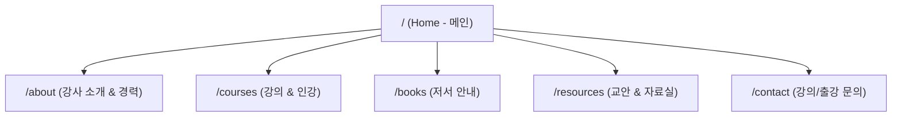

# [PRD] IT 전문 강사 개인 포트폴리오 & 교육 콘텐츠 허브

> **문서 버전**: v1.0  
> **작성일**: 2026-09-01  
> **기반 문서**: `claude_사이트_기획.md` + `gemini_Site_Plan.md` 통합 병합본  
> **대상**: Java, Spring, AI, Big Data, Python, Flutter 등 IT 다방면 전문 강사이자 2권의 저서를 보유한 저자의 개인 브랜딩 웹사이트

---

## 1. 프로젝트 개요 및 비전

### 1.1 배경 및 목적
- **개인 브랜딩 및 신뢰성 구축**: Java부터 AI, 빅데이터, 모바일(Flutter)까지 폭넓은 실무 및 강의 경험과 저서 2권의 전문성을 직관적으로 전달합니다.
- **교육 콘텐츠 허브**: 교안, 인강, GitHub 실습 자료를 수강생에게 체계적으로 제공하는 중앙 허브 역할을 수행합니다.
- **강의/출강 비즈니스 창출**: 기업, 대학, 학원 교육 담당자가 손쉽게 출강 이력과 전문성을 검토하고 강의를 의뢰할 수 있는 접점을 마련합니다.
- **도서 및 인강 홍보**: 출판 도서(구매처 링크) 및 온라인 강의(인프런 등)로의 트래픽 전환을 극대화합니다.

### 1.2 핵심 타겟 페르소나
1. **기업/교육기관 교육 담당자 (HR/기획자)**:
   - 강사의 전문 분야, 강의 이력, 출판 도서, 강의 스타일 확인 후 출강 의뢰
2. **수강생 및 개발 학습자**:
   - 과목별 교안 및 실습 코드 다운로드, 온라인 강의 링크 확인
3. **출판사 / 세미나 주최자**:
   - 저자 프로필, 집필 이력, 연락처 및 협업 가능성 검토

---

## 2. 시스템 아키텍처 및 기술 스택

### 2.1 프론트엔드 렌더링 전략: SSG / SSR 하이브리드
- **결론**: **순수 CSR SPA(Single Page Application) 지양, SSG/SSR 기반 하이브리드 아키텍처 채택**
- **채택 이유**:
  - **검색엔진 최적화 (SEO)**: 강사 이름, 저서명, 강의 과목 검색 시 구글/네이버 상위 노출 필수
  - **소셜 공유 (Open Graph)**: 교안, 저서, 인강 링크 공유 시 풍부한 미리보기 카드 제공
  - **빠른 초기 로딩 & 부드러운 전환**: 정적 HTML 서빙으로 속도를 극대화하고, 탭 전환 및 필터링 등은 클라이언트 인터랙션으로 매끄럽게 처리

### 2.2 권장 기술 스택

| 영역 | 기술 스택 | 선정 사유 |
| :--- | :--- | :--- |
| **Frontend Framework** | **Next.js (App Router, React)** 또는 **Astro** | 강력한 SSG/SSR 지원, 뛰어난 SEO 및 향후 API 라우트 확장성 |
| **Styling** | **Tailwind CSS** 또는 **Modern Vanilla CSS** | 깔끔하고 모던한 테크 룩앤필, 다크모드 및 반응형 UI 신속 구현 |
| **Data Layer (초기)** | **정적 JSON / Markdown (Frontmatter)** | 백엔드 없이도 즉시 배포 가능, Git을 통한 손쉬운 콘텐츠 갱신 |
| **Data Layer (확장)** | **Spring Boot / Node.js API** (별도 관리자 구축 시) | 향후 관리자 모드 CRUD 및 교안 다운로드 통계 기능 연동 |
| **Hosting & Deployment** | **Vercel / GitHub Pages** | 무중단 자동 배포(CI/CD) 및 글로벌 CDN 기반 빠른 응답 속도 |

---

## 3. 사이트 정보 구조 (Information Architecture) & 사이트맵



### 3.1 세부 페이지별 기능 정의

#### 1) 메인 페이지 (`/`)
- **히어로 섹션 (Hero)**:
  - 핵심 캐치프레이즈 (예: *"Java부터 AI까지, 실무와 집필 노하우로 증명하는 IT 전문 강사 성낙현"*)
  - 프로필 사진 + 대표 저서 2권 표지 쇼케이스 + 핵심 CTA 버튼 ([강의 문의하기], [교안/자료실 둘러보기])
- **핵심 지표 요약 (Stats Callout)**:
  - 총 강의 경력 연수, 누적 수강생 수, 집필 저서(2권), 출강 기관 수
- **기술 스택 프리뷰 (Tech Stack)**:
  - 4개 카테고리(백엔드, 프론트/모바일, AI/데이터, DevOps) 핵심 태그
- **대표 저서 & 인기 교안 하이라이트**:
  - 카드 형태 썸네일 노출 및 상세 페이지 이동 링크

#### 2) 강사 소개 & 경력 (`/about`)
- **강사 프로필 & 강의 철학**:
  - 전문 분야, 강의 모토, 전달력과 실무 적용 중심의 교육 철학 서술
- **경력 타임라인 (Timeline UI)**:
  - 연도별 기업 출강, 대학/학원 강의, 세미나 발표, 프로젝트 수행 이력 시각화
- **자격 및 학력/활동**:
  - 보유 자격증, 커뮤니티 활동, 멘토링 이력

#### 3) 강의 & 인강 (`/courses`)
- **과목별 오프라인/출강 커리큘럼**:
  - `Java/Spring Fullstack`, `Python & AI / Big Data`, `HTML/CSS/JS & Flutter` 등
- **온라인 동영상 강의 (인강)**:
  - 인프런 등 플랫폼별 개설 강좌 카드 (썸네일, 수강생 평점, 핵심 학습목표, 수강 신청 바로가기)

#### 4) 저서 소개 (`/books`)
- **대표 저서 2권 상세 쇼케이스**:
  - 3D/실물 도서 표지 이미지, 도서명, 출판사, 출간일, ISBN
  - 책 소개글, 주요 타겟 독자, 핵심 목차 요약
  - 주요 서점 구매 링크 (교보문고, YES24, 알라딘)

#### 5) 교안 및 자료실 (`/resources`)
- **수강생 학습 자료 허브**:
  - **과목별 분류 탭 (Filter Tabs)**: `All` | `Java/Spring` | `Python/AI` | `Frontend/Flutter` | `Database/BigData`
  - **자료 카드 항목**: 자료 제목, 과목 태그, 난이도, 형식(PDF/Slides/Code), 다운로드 링크 또는 GitHub 레포지토리 연결

#### 6) 강의/출강 문의 (`/contact`)
- **문의 양식 (Inquiry Form)**:
  - 의뢰 기관/기업명, 담당자 이름, 연락처(이메일/전화번호), 강의 희망 분야 및 일정, 문의 내용
- **직접 연락처 & 소셜 링크**:
  - 공식 이메일, GitHub, 기술 블로그, LinkedIn 등

---

## 4. UI / UX 디자인 및 톤앤매너

1. **디자인 무드**: **Professional, Modern Tech, Trustworthy**
   - 다루는 기술 스펙트럼(Java ~ AI ~ Flutter)이 넓으므로 특정 언어의 상징색에 치우치지 않는 세련된 슬레이트/다크 네이비 기반 테크 룩을 지향합니다.
2. **다크 모드 & 라이트 모드 지원**:
   - 개발자 및 교육 담당자 모두에게 편안한 가독성 제공
3. **인터랙션 & 모션**:
   - 과도한 모션을 지양하고 직관적인 카드 호버 효과, 탭 전환 애니메이션, 스크롤 인터랙션 적용
4. **반응형 웹**:
   - Desktop, Tablet, Mobile 모든 환경에서 최적화된 레이아웃 제공

---

## 5. 데이터 모델 및 콘텐츠 인벤토리 (Data Schema)

초기에는 JSON/Frontmatter로 관리하며, 향후 관리자 모드 백엔드 DB 스키마의 기반이 됩니다.

### 5.1 데이터 모델 정의

```typescript
// 1. 저서 (Book)
interface Book {
  id: string;
  title: string;
  subtitle?: string;
  coverImage: string;
  publisher: string;
  publishedDate: string;
  isbn: string;
  description: string;
  tocSummary: string[];
  purchaseLinks: {
    store: 'kyobo' | 'yes24' | 'aladin' | 'other';
    url: string;
  }[];
}

// 2. 교안/자료 (Resource)
interface Resource {
  id: string;
  title: string;
  category: 'Java/Spring' | 'Python/AI' | 'Frontend' | 'Flutter' | 'BigData';
  difficulty: 'Beginner' | 'Intermediate' | 'Advanced';
  description: string;
  fileUrl?: string;
  githubUrl?: string;
  updatedAt: string;
}

// 3. 인강 (Course)
interface Course {
  id: string;
  title: string;
  platform: 'Inflearn' | 'FastCampus' | 'YouTube' | 'Other';
  thumbnail: string;
  rating?: number;
  tags: string[];
  courseUrl: string;
  description: string;
}

// 4. 경력 (CareerItem)
interface CareerItem {
  id: string;
  period: string; // 예: "2024 - 현재" 또는 "2023.03 - 2023.12"
  organization: string;
  role: string; // 예: "전문 강사", "겸임 교수"
  topic: string;
  description?: string;
}
```

---

## 6. 개발 및 구현 로드맵 (7-Step Implementation Plan)


- **Step 1. 콘텐츠 인벤토리 확정**: 프로필, 저서 2권 메타데이터, 대표 교안 목록, 경력 이력 텍스트/이미지 수집
- **Step 2. 정보 구조(IA) 및 와이어프레임**: 메뉴별 화면 레이아웃 및 반응형 그리드 설계
- **Step 3. 디자인 시스템 구축**: 폰트, 컬러 팔레트, 공통 UI 컴포넌트(버튼, 카드, 탭, 뱃지) 정의
- **Step 4. 프론트엔드 프로젝트 셋업**: Next.js (또는 Astro) 기반 프로젝트 환경 구축 및 기본 레이아웃 구성
- **Step 5. 페이지 및 컴포넌트 개발**: 메인, 소개, 강의/인강, 저서, 교안실, 문의 폼 구현
- **Step 6. SEO 및 성능 최적화**: 메타 태그, Open Graph 이미지, 사이트맵/robots.txt, 로딩 속도 최적화
- **Step 7. 배포 및 향후 백엔드 확장**: Vercel/GitHub Pages 배포 후 필요 시 별도 관리자 모드(Spring Boot 등) 연동 준비

---

## 7. 성공 지표 (KPIs)

1. **SEO 검색 노출**: 강사명 및 주요 도서/강의 키워드 검색 시 1페이지 상위 랭크
2. **사용자 경험 (UX)**: 모바일/데스크톱 PageSpeed Insights 점수 90점 이상 달성
3. **비즈니스 전환**: 출강 문의 폼을 통한 기업/기관의 실제 강의 의뢰 건수 및 도서/인강 유입 증가
